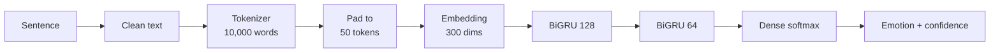
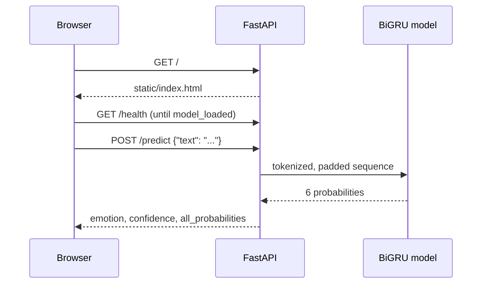

<div align="center">

# Emotion Classifier

**Type a sentence and see which emotion it carries, in real time. A Bidirectional GRU served with FastAPI and an animated web interface.**


[Live demo]([https://YOUR-APP-NAME.onrender.com](https://emotion-classifier-fastapi.onrender.com)) · [API docs](https://YOUR-APP-NAME.onrender.com/docs) · [Training notebook](DL_Emotion_Classification.ipynb)


</div>

---

## Table of contents

- [Overview](#overview)
- [Features](#features)
- [How it works](#how-it-works)
- [Model](#model)
- [Dataset](#dataset)
- [Results](#results)
- [Project structure](#project-structure)
- [Getting started](#getting-started)
- [API reference](#api-reference)
- [Web interface](#web-interface)
- [Deploy on Render](#deploy-on-render)
- [Troubleshooting](#troubleshooting)
- [Limitations](#limitations)
- [Roadmap](#roadmap)
- [Acknowledgements](#acknowledgements)
- [Author](#author)

## Overview

Emotion Classifier reads a short English sentence and predicts one of six emotions: **sadness, joy, love, anger, fear or surprise**. It returns the winning emotion, a confidence score and the probability of every class.

The repository covers the full path from research to product:

1. **Research:** a notebook that compares four recurrent architectures on a labeled emotion dataset.
2. **Serving:** a FastAPI service that loads the best model once at startup and exposes a validated REST API.
3. **Interface:** a dependency-free web page where the colors and motion of the whole page respond to the prediction.

## Features

- Six-class emotion prediction with confidence and the full probability distribution
- Bidirectional GRU that reads each sentence in both directions
- Input validation (1 to 120 characters), clear error codes and a health endpoint
- Automatic interactive API documentation at `/docs`
- Animated interface in plain HTML, CSS and JavaScript, with no build step and no framework
- Cold-start aware: the interface polls `/health` and shows when the model is ready
- Accessible by default: keyboard navigation, visible focus and `prefers-reduced-motion` support
- Responsive layout that works on phones

## How it works



1. **Clean:** lowercase the text, remove commas, replace other punctuation with spaces and collapse whitespace.
2. **Tokenize:** a Keras `Tokenizer` fitted on the training set maps each word to an integer. Words outside the 10,000-word vocabulary become `<unk>`.
3. **Pad:** every sequence is padded or truncated to exactly 50 tokens.
4. **Predict:** the network outputs six probabilities that sum to 1. The highest one is the predicted emotion.

At runtime the browser talks to a single FastAPI process that serves both the interface and the model:



## Model

| Layer | Configuration | Output shape |
|---|---|---|
| Embedding | 10,000 words, 300 dimensions | (50, 300) |
| Bidirectional GRU | 128 units per direction, returns sequences | (50, 256) |
| Dropout | rate 0.5 | (50, 256) |
| Bidirectional GRU | 64 units per direction | (128) |
| Dropout | rate 0.5 | (128) |
| Dense | 6 units, softmax | (6) |

Total: **3,454,662 trainable parameters** (about 13 MB).

| Training setting | Value |
|---|---|
| Optimizer | Adam |
| Loss | Sparse categorical cross-entropy |
| Batch size | 32 |
| Max epochs | 20 |
| Class weights | Balanced (inverse class frequency) |
| Early stopping | Monitor `val_loss`, patience 3, restore best weights |
| Sequence length | 50 tokens |
| Hardware | Google Colab, T4 GPU |

Early stopping ended training after epoch 6 and restored the weights from epoch 3, which had the lowest validation loss (0.213).

## Dataset

The model is trained on [`dair-ai/emotion`](https://huggingface.co/datasets/dair-ai/emotion), a collection of English Twitter messages labeled with one of six emotions.

| Split | Sentences |
|---|---|
| Train | 16,000 |
| Validation | 2,000 |
| Test | 2,000 |

The training set is imbalanced, which is why balanced class weights are used:

| Emotion | Training sentences |
|---|---|
| Joy | 5,362 |
| Sadness | 4,666 |
| Anger | 2,159 |
| Fear | 1,937 |
| Love | 1,304 |
| Surprise | 572 |

The fitted tokenizer contains 15,213 distinct words, of which the 10,000 most frequent are kept.

## Results

Four architectures were trained with the same data, optimizer and callbacks:

| Model | Test accuracy | Test loss |
|---|---|---|
| **Bidirectional GRU** | **92.5%** | **0.213** |
| SimpleRNN | 31.7% | 1.758 |
| LSTM | 28.9% | 1.778 |
| GRU | 3.4% | 1.802 |

The three unidirectional baselines did not converge under these settings. Their validation accuracy swung widely between epochs, and early stopping ended them after three. The comparison therefore shows how stable the bidirectional model is, not only how accurate it is. The notebook also contains the confusion matrix and sample predictions.

Example predictions from the deployed model:

| Sentence | Prediction | Confidence |
|---|---|---|
| i feel like nobody noticed i was gone | sadness | 98% |
| i feel so loved and cared for by my family | love | 99% |
| i am furious that they cancelled the trip | anger | 99% |
| i feel terrified walking down dark alleys alone | fear | 100% |
| i feel amazed and stunned by the news | surprise | 100% |

## Project structure

```
emotion-classifier-fastapi/
├── main.py                           FastAPI application
├── Artifacts/
│   ├── BiGRU_model.keras             Trained model
│   └── tokenizer.pkl                 Fitted tokenizer
├── static/
│   ├── index.html                    Web interface
│   ├── style.css                     Styles and animations
│   └── script.js                     Interface logic and particle field
├── assets/
│   └── demo.png                      Screenshot used in this README
├── DL_Emotion_Classification.ipynb   Training and evaluation notebook
├── requirements.txt                  Python dependencies
├── .python-version                   Python version used by Render
└── .gitignore
```

## Getting started

### Prerequisites

- Python **3.12** (TensorFlow does not yet publish wheels for the newest Python releases)
- About 1 GB of free disk space for TensorFlow
- `git`, and `conda` or `venv`

### Install and run

```bash
git clone https://github.com/thelon1/emotion-classifier-fastapi.git
cd emotion-classifier-fastapi

conda create -n emotion python=3.12 -y
conda activate emotion

pip install -r requirements.txt
uvicorn main:app --reload
```

Then open:

| URL | What you get |
|---|---|
| http://127.0.0.1:8000 | The web interface |
| http://127.0.0.1:8000/docs | Interactive Swagger documentation |
| http://127.0.0.1:8000/health | Health check |

The first start takes a few seconds while the model loads.

## API reference

### `POST /predict`

Classifies one sentence.

**Request body**

| Field | Type | Rules |
|---|---|---|
| `text` | string | Required, 1 to 120 characters, must contain letters or numbers |

**Response**

| Field | Type | Description |
|---|---|---|
| `text` | string | The original input |
| `predicated_emotion` | string | One of `sadness`, `joy`, `love`, `anger`, `fear`, `surprise` |
| `confidence` | float | Probability of the predicted emotion, from 0 to 1 |
| `all_probabilities` | object | Probability for each of the six emotions |

> The field is spelled `predicated_emotion` in the current API. Keep that spelling when calling it, or rename it in both `main.py` and `static/script.js`.

**curl**

```bash
curl -X POST http://127.0.0.1:8000/predict \
  -H "Content-Type: application/json" \
  -d '{"text": "I feel like i am in love with you"}'
```

**PowerShell**

```powershell
Invoke-RestMethod -Uri http://127.0.0.1:8000/predict -Method Post `
  -ContentType "application/json" `
  -Body '{"text": "I feel like i am in love with you"}'
```

**Python**

```python
import requests

r = requests.post(
    "http://127.0.0.1:8000/predict",
    json={"text": "I feel like i am in love with you"},
)
print(r.json()["predicated_emotion"])
```

**Response**

```json
{
  "text": "I feel like i am in love with you",
  "predicated_emotion": "love",
  "confidence": 0.607,
  "all_probabilities": {
    "sadness": 0.022,
    "joy": 0.163,
    "love": 0.607,
    "anger": 0.196,
    "fear": 0.005,
    "surprise": 0.008
  }
}
```

### `GET /health`

Returns the server and model state.

```json
{ "status": "Server is running", "model_loaded": true }
```

### Error codes

| Status | Meaning | What to do |
|---|---|---|
| 422 | Input is empty, longer than 120 characters or has no letters or numbers | Send a valid sentence |
| 503 | The model is still loading | Retry in a few seconds |

## Web interface

The interface is built to make the model's output easy to feel, not only to read.

| Emotion | Color | Particle behavior |
|---|---|---|
| Sadness | Blue | Particles sink slowly |
| Joy | Yellow | Particles rise quickly and grow |
| Love | Pink | Particles pulse in size |
| Anger | Red | Particles jitter fast |
| Fear | Purple | Particles flicker and tremble |
| Surprise | Teal | Particles burst outward |

Other details:

- The page accent color transitions smoothly to the detected emotion.
- A confidence ring fills, the percentage counts up and the six probability bars animate in order.
- The particles move away from your cursor.
- If the top confidence is below 60%, the result also names the second most likely emotion.
- Press **Enter** to analyze. Use **Shift+Enter** for a new line.
- The last five results are kept so you can run them again.
- Animations switch off when the operating system requests reduced motion.

## Deploy on Render

1. Push the repository to GitHub, including the `Artifacts/` folder.
2. In Render, create a new **Web Service** and connect the repository.
3. Use these settings:

| Setting | Value |
|---|---|
| Runtime | Python 3 |
| Build command | `pip install -r requirements.txt` |
| Start command | `uvicorn main:app --host 0.0.0.0 --port $PORT` |
| Environment variable | `PYTHON_VERSION` = `3.12.7` |

Render picks a very recent Python by default, and TensorFlow has no wheels for it. Pin the version with the environment variable above or with the `.python-version` file in the repository root. Render does not read `runtime.txt`.

The free instance has 512 MB of RAM and sleeps after a period without traffic, so the first request after a pause is slow. The interface shows a status indicator while the server wakes up.

## Troubleshooting

| Symptom | Cause | Fix |
|---|---|---|
| `No matching distribution found for tensorflow-cpu` during build | Render used a Python version that TensorFlow does not support | Set `PYTHON_VERSION` to `3.12.7` and run **Clear build cache and deploy** |
| `static/index.html not found` at `/` | The file was not committed to the repository | Add `static/index.html` and push |
| Error while loading `BiGRU_model.keras` | Keras version differs from the one that saved the model | Keep `keras==3.13.2` and `tensorflow-cpu==2.20.0` |
| Service restarts or runs out of memory on start | TensorFlow needs more than 512 MB | Use a larger Render instance |
| Interface says "Cannot reach the server" | The API is not running or the request was blocked | Check the server logs and the `/health` endpoint |

## Limitations

- **Phrasing matters.** The training sentences are first-person statements such as "i feel ...". Text in other styles can be misclassified. For example, "you are the best thing that ever happened to me" is predicted as anger, while "i feel so loved and cared for by my family" is predicted as love with 99% confidence.
- **English only**, and short text only (the interface allows up to 120 characters).
- **One label per sentence.** Real sentences often carry mixed emotions, so look at the probability bars as well as the top label.
- **Slightly optimistic accuracy.** The test split was also used for early stopping. A separate validation split would give a stricter estimate.
- **Small preprocessing mismatch.** The API replaces apostrophes with spaces ("can't" becomes "can t"), while the training data writes contractions without them ("cant").

## Roadmap

- [ ] Hold out a separate validation split and re-report accuracy
- [ ] Per-class precision, recall and F1 in the notebook
- [ ] Align API preprocessing with the training data
- [ ] Compare against a transformer baseline such as DistilBERT
- [ ] Batch prediction endpoint
- [ ] Docker image and CI workflow

## Acknowledgements

- Dataset: [`dair-ai/emotion`](https://huggingface.co/datasets/dair-ai/emotion), from Saravia et al., *CARER: Contextualized Affect Representations for Emotion Recognition* (EMNLP 2018)
- Built with [TensorFlow / Keras](https://www.tensorflow.org/), [FastAPI](https://fastapi.tiangolo.com/) and [Hugging Face Datasets](https://huggingface.co/docs/datasets)
- Fonts: [Fraunces](https://fonts.google.com/specimen/Fraunces) and [Manrope](https://fonts.google.com/specimen/Manrope)

## Author

**Rohit** · [GitHub @thelon1](https://github.com/thelon1)

If this project helped you, consider giving it a star.
